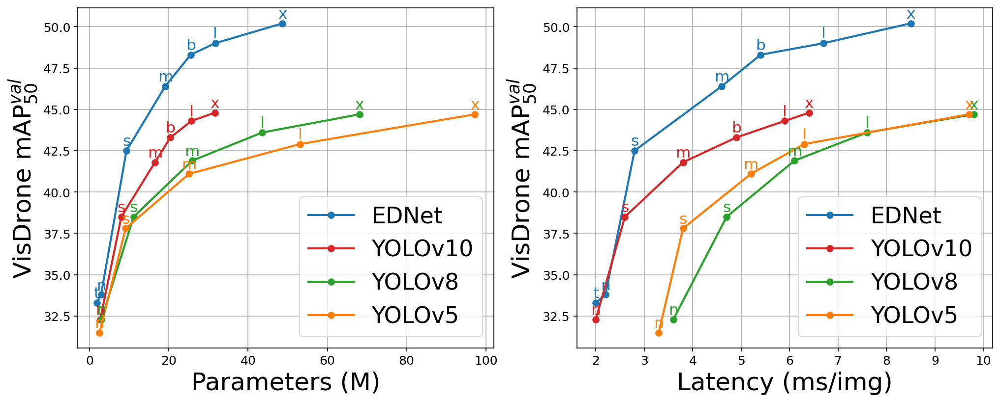
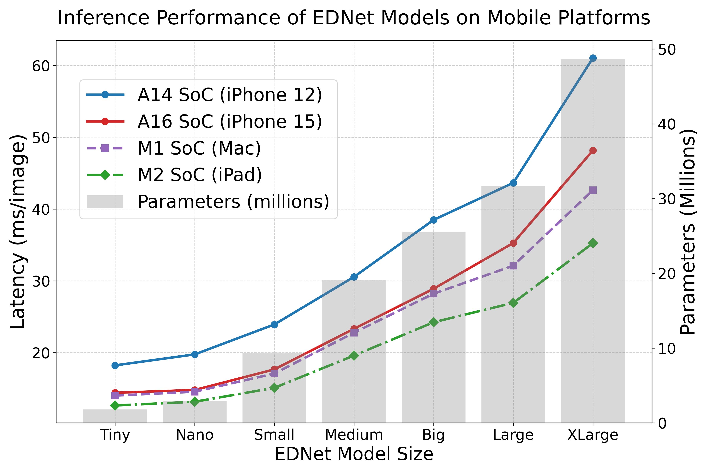

# [EDNet: Edge-Optimized Small Target Detection in UAV Imagery](https://arxiv.org/abs/2501.05885)

This repository contains the implementation of EDNet, an improved target detection framework for edge computing on drones.
<p align="center">
  
</p>

EDNet is an enhanced target detection framework based on improved YOLOv10, optimized for detecting tiny targets in drone imagery. Key innovations include:
- **Cross Concat Strategy & XS Detection Head**: Improved fine-grained feature fusion and multi-scale context.
- **C2f-FCA Block**: Uniquely designed faster context attention bottleneck for better feature extraction with reduced computational complexity.
- **WIoUv3 Loss**: Enhanced bounding box regression.

EDNet is available in seven sizes, from Tiny to XL. The package is built based on the [Ultralytics](https://github.com/ultralytics/ultralytics) package. It outperforms YOLOv10 variants at a larger size starting from the S variant, achieves up to a 5.6% gain in mAP@50 with significantly fewer parameters. For mobile computing, CoreML is utilized to interface the CPU and NPU. EDNet variants operate at speeds ranging from 16 to 55 FPS on an iPhone 12, providing a scalable and efficient solution for edge-based object detection in challenging drone imagery. 


The performance of the seven variants of EDNet on the VisDrone dataset is summarized in the table below:
| Model                                                                 | Size<br><sup>(pixels) | mAP<sup>val<br>50 (%) | mAP<sup>val<br>50-95 (%) | Speed<br><sup>A14 SoC CoreML<br>(ms) | Speed<br><sup>A100 TensorRT<br>(ms) | Params.<br><sup>(M) | Pre-trained Weights                                                                                      |
| --------------------------------------------------------------------- | --------------------- | ------------------ | ---------------------- | ------------------------------ | ----------------------------------- | ------------------ | -------------------------------------------------------------------------------------------- |
| EDNet-Tiny       | 640                   | 34.1                 | 19.5                    | 18.2                            | 2.0                                 | 1.8                | [tiny.pt](https://github.com/zsniko/EDNet/blob/main/pretrained/tiny.pt)                  |
| EDNet-N           | 640                   | 34.3                 | 19.8                    | 19.8                            | 2.9                                 | 2.9                | [nano.pt](https://github.com/zsniko/EDNet/blob/main/pretrained/nano.pt)                       |
| EDNet-S           | 640                   | 42.6                 | 25.6                    | 23.9                            | 2.8                                 | 9.3                | [small.pt](https://github.com/zsniko/EDNet/blob/main/pretrained/small.pt)                       |
| EDNet-M           | 640                   | 47.1                 | 28.7                    | 30.6                           | 4.6                                 | 19.1               | [medium.pt](https://github.com/zsniko/EDNet/blob/main/pretrained/medium.pt)                       |
| EDNet-B           | 640                   | 48.5                 | 29.9                    | 38.5                           | 5.4                                 | 25.5               | [big.pt](https://github.com/zsniko/EDNet/blob/main/pretrained/big.pt)                       |
| EDNet-L          | 640                   | 49.3                 | 30.4                    | 43.7                           | 6.7                                 | 31.7               | [large.pt](https://github.com/zsniko/EDNet/blob/main/pretrained/large.pt)                       |
| EDNet-X          | 640                   | 50.6                 | 31.2                    | 61.1                           | 8.5                                 | 48.7               | [xlarge.pt](https://github.com/zsniko/EDNet/blob/main/pretrained/xlarge.pt)                       |

<details open>
<summary>Install</summary>
Clone the repository and install the required dependencies:

```bash
git clone https://github.com/zsniko/EDNet.git
cd EDNet
pip install -r requirements.txt
```

</details>


</details>

<details open>
<summary>Usage</summary>

EDNet can be called directly from the package. Use the `train` method to train the model:

```python
from ednet import EDNet
# Build a model from scratch (choose from: t,n,s,m,b,l,x)
model = EDNet("ednet-t.yaml") 
# Train the model
model.train(data="visdrone-det.yaml", epochs=200, imgsz=640)  
```

To validate a pre-trained model, use the `val` method. For predictions, simply provide the path to the image:

```python
from ednet import EDNet
# Load a pretrained model (choose from: t,n,s,m,b,l,x)
model = EDNet("pretrained/tiny.pt") 
# Evaluate the model
model.val(data="visdrone-det", split='val')  
# Predict (change the path to your image)
model('ednet/assets/test1.jpg')  
```

You can export the model to different formats based on your hardware, such as TensorRT, ONNX, and OpenVINO. The `format` argument specifies the export format (`engine` for TensorRT; for ONNX and OpenVINO, use the format name directly).
```python
# Load a pretrained model (choose from: t,n,s,m,b,l,x)
model = EDNet("pretrained/tiny.pt") 
# Export the model
model.export(format='onnx') 
```

</details>

Mobile computing evaluation:
<p align="center">
  
</p>

Sample predictions with EDNet model iOS deployment (a) EDNet-Tiny; (b) EDNet-B (red dotted boxes are manually added after predicted bounding boxes to highlight the difference in detection capabilities):
<p align="center">
  
</p>

#### Citation

```plaintext
@misc{ednet2025,
    title={EDNet: Edge-Optimized Small Target Detection in UAV Imagery -- Faster Context Attention, Better Feature Fusion, and Hardware Acceleration},
    author={Zhifan Song and Yuan Zhang and Abd Al Rahman M. Abu Ebayyeh},
    year={2025},
    eprint={2501.05885},
    archivePrefix={arXiv},
    primaryClass={cs.CV}
}
```

<br>
<div align="center">
  <a href="https://www.imperial.ac.uk/electrical-engineering/"></a>
</div>


